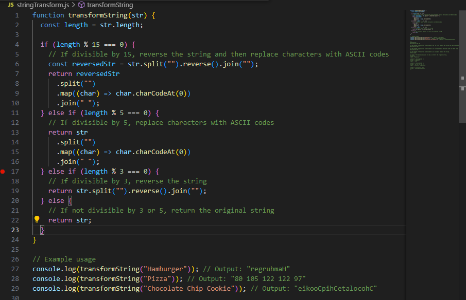
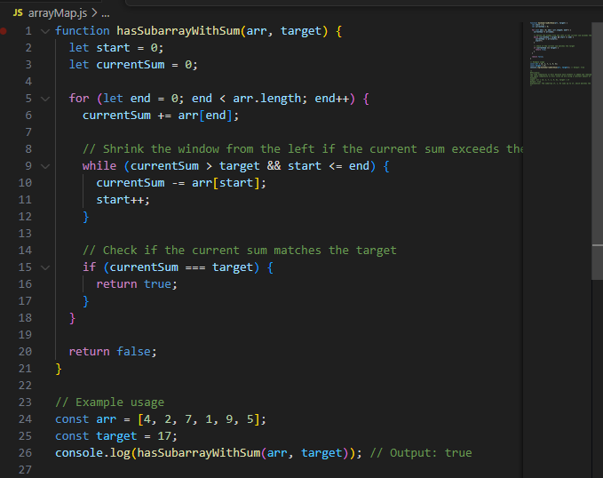

Documentation

- 1. Gallery App

Overview
The Gallery App displays a set of images in a responsive, full-screen layout. Each image shows a title and a subtitle, and on hover, a blur effect is applied, revealing additional details.

- Files

index.html: The main HTML file.
style.css: The CSS file for styling.
script.js: The JavaScript file for any interactive behavior.

- 2.  String Transformation
      Overview
      The String Transformation script transforms a given string based on its length:

Reverse the string if its length is divisible by 3.
Replace each character with its ASCII code if its length is divisible by 5.
Apply both transformations in the specified order if its length is divisible by both 3 and 5 (i.e., 15).

           Explanation

      Check Divisibility:

      Use modulo operations to check if the string length is divisible by 3, 5, or 15.
      Transform String:
      If divisible by 15, reverse the string and replace each character with its ASCII code.
      If divisible by 3, reverse the string.
      If divisible by 5, replace each character with its ASCII code.

      Complexity
      Time Complexity: O(n) where n is the length of the string.
      Space Complexity: O(n) for storing the transformed string.

- 3.  Array Manipulation
      Overview
      This script checks if there exists a contiguous subarray within a given array that sums up to a target value.

            Explanation

    Sliding Window Technique:

    Maintain a window defined by two pointers: start and end.
    Expand the window by moving end to the right and adding the current element to currentSum.
    Shrink the window from the left by moving start to the right and subtracting the element at start from currentSum if currentSum exceeds the target.
    Return true if currentSum equals the target.

    Complexity
    Time Complexity: O(n), where n is the length of the array.
    Space Complexity: O(1), as it uses a constant amount of extra space.
